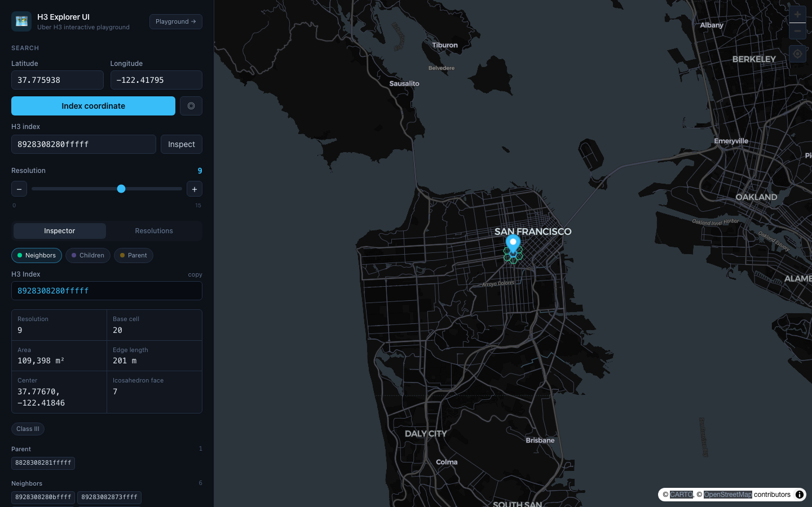
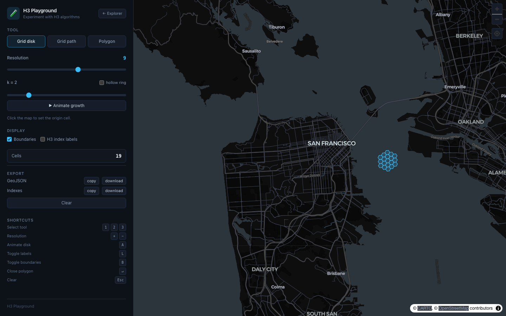

<div align="center">

# 🗺️ H3 Explorer UI

### The interactive playground for Uber's H3 Geospatial Indexing System

Explore, learn, debug and experiment with [H3](https://h3geo.org) — visually.

[](https://github.com/JesusCabreraReveles/h3-explorer-ui/actions/workflows/ci.yml)
[](https://github.com/JesusCabreraReveles/h3-explorer-ui/releases)
[](https://go.dev)
[](./LICENSE)

</div>

---

> **Status:** ✅ All six phases are complete — a full-stack, end-to-end tool:
> the **H3 API** (Go, Clean Architecture), an interactive **inspector**
> (coordinate/index search, clickable parent · children · neighbors, map
> overlays, resolution explorer), an **H3 Playground** (`gridDisk`/`gridRing`
> with k animation, `gridPath`, `polygonToCells`, index labels), **GeoJSON /
> CSV / index export**, and **keyboard shortcuts** throughout.

## Motivation

[H3](https://h3geo.org) is a brilliant hierarchical hexagonal grid system, but
its concepts — resolutions, `gridDisk`, `gridRing`, parent/child relationships,
pentagons, icosahedron faces — are far easier to _understand_ when you can
**see** them. Most people learn H3 by pasting indexes into a REPL.

**H3 Explorer UI** is built to be the tool I wish I had when I started with H3:
a real engineering instrument that lets you click a hexagon and immediately see
its geometry, topology and neighbours on a map — backed by a clean, well-tested
Go API rather than ad-hoc browser scripts.

This is intentionally **not** a tutorial repo. It is structured the way a
production service is structured, so it doubles as a reference for Clean
Architecture in Go and scalable SvelteKit on the frontend.

## ✨ Features

| Area | What you get |
|------|--------------|
| **Coordinate search** | Resolve any lat/lng to its H3 cell at resolutions 0–15 |
| **Inspector** | Center, boundary, area, edge length, base cell, icosahedron faces, parent, children, neighbours, pentagon & Class III flags |
| **Resolution explorer** | Aggregate metadata (avg area, avg edge length, total cells) for every resolution |
| **Playground** | Animate `gridDisk(k)`/`gridRing(k)`, draw routes (`gridPath`) & polygons (`polygonToCells`), toggle index labels & boundaries |
| **Export** | GeoJSON (FeatureCollection), boundary CSV, H3 index lists — copy or download |
| **Keyboard-driven** | Shortcuts for resolution, overlays, tools, labels, and clearing |
| **API-first** | Every H3 computation runs server-side and is documented with OpenAPI 3.1 |

## 🏛️ Architecture

The repository is a single monorepo with a clean separation between an
**API-first Go backend** (all H3 business logic) and a **SvelteKit frontend**
(pure presentation + interaction). The frontend never re-implements H3 logic.

```
┌──────────────────────────┐         ┌───────────────────────────────────────┐
│   Frontend (SvelteKit)    │  HTTP   │            Backend (Go)               │
│                           │ ──────► │                                       │
│  MapLibre · h3-js (hints) │  JSON   │  API ─► Service ─► Domain  (uber/h3)  │
│  stores · services · UI   │ ◄────── │  Clean Architecture · OpenAPI 3.1     │
└──────────────────────────┘         └───────────────────────────────────────┘
```

### Backend — Clean Architecture

Dependencies point **inward**. The domain has zero knowledge of HTTP or h3-go;
the service implements the domain port using h3-go; the transport layer depends
only on the port and is wired together in a single composition root.

```
cmd/server          → composition root: config, DI, HTTP server, graceful shutdown
internal/
  domain            → pure types + the H3Service port (no external deps)
  service/h3        → the ONLY package importing uber/h3-go
  api               → chi router wiring
  api/handler       → HTTP adapters (DTOs, JSON, error envelope)
  api/middleware    → structured logging, panic recovery, request-scoped logger
  config            → 12-factor env config + validation
  openapi           → embedded OpenAPI 3.1 contract
pkg/logging         → slog setup + context propagation helpers
```

**Why this matters:** you can swap the H3 binding, add a gRPC transport, or unit
test handlers with a fake service — without touching business logic. Each arrow
in `domain ← service ← handler ← main` is enforced by the package layout.

## 📁 Repository structure

```
h3-explorer-ui/
├── backend/                # Go API (Clean Architecture) ✅
│   ├── cmd/server/
│   ├── internal/
│   ├── pkg/
│   ├── Dockerfile
│   └── go.mod
├── frontend/               # SvelteKit + MapLibre app ✅
│   ├── src/lib/            # components, services, stores, types, utils
│   ├── src/routes/
│   ├── src/hooks.server.ts # same-origin API proxy
│   └── Dockerfile
├── .github/workflows/      # CI: build, test (race), lint, docker
├── docker-compose.yml
├── LICENSE
└── README.md
```

## 🚀 Getting started

### Prerequisites

- **Go 1.25+** (the project is developed on 1.26)
- A C compiler (`gcc`/`clang`) — `uber/h3-go` uses cgo
- **Node 20.19+ / 22.12+** for the frontend
- **Docker** (optional, for the containerised path)

### Run with Docker (whole stack)

```bash
docker compose up --build
```

- Frontend → <http://localhost:3000>
- Backend API → <http://localhost:8080>

The frontend proxies `/api` and `/health` to the backend over the compose
network, so the browser only ever talks to a single origin.

### Run locally (two terminals)

```bash
# 1) backend
cd backend
go run ./cmd/server          # serves :8080

# 2) frontend
cd frontend
npm install
npm run dev                  # serves :5173, proxies /api → :8080
```

Open <http://localhost:5173>, click anywhere on the map (or enter coordinates),
and drag the resolution slider to re-index instantly.

### Configuration

All configuration is via environment variables (12-factor):

| Variable | Default | Description |
|----------|---------|-------------|
| `H3_HOST` | `0.0.0.0` | Bind host |
| `H3_PORT` | `8080` | Bind port |
| `H3_LOG_LEVEL` | `info` | `debug` \| `info` \| `warn` \| `error` |
| `H3_LOG_FORMAT` | `json` | `json` \| `text` |
| `H3_CORS_ALLOWED_ORIGINS` | `http://localhost:5173` | Comma-separated origins |
| `H3_READ_TIMEOUT` | `10s` | HTTP read timeout |
| `H3_WRITE_TIMEOUT` | `15s` | HTTP write timeout |
| `H3_SHUTDOWN_TIMEOUT` | `15s` | Graceful shutdown budget |

## 📡 API documentation

The full contract is an embedded OpenAPI 3.1 document served at
<http://localhost:8080/openapi.yaml> (and committed at
[`backend/internal/openapi/openapi.yaml`](./backend/internal/openapi/openapi.yaml)).

| Method | Path | Description |
|--------|------|-------------|
| `GET`  | `/health` | Liveness/readiness probe |
| `GET`  | `/api/h3/resolutions` | Metadata for every resolution (0–15) |
| `POST` | `/api/h3/from-coordinates` | Index a lat/lng → full cell |
| `POST` | `/api/h3/to-boundary` | Boundary ring of a cell |
| `POST` | `/api/h3/inspect` | Full inspector view of a cell |
| `POST` | `/api/h3/grid-disk` | All cells within grid distance `k` (filled disk) |
| `POST` | `/api/h3/grid-ring` | Hollow ring of cells at distance `k` |
| `POST` | `/api/h3/grid-path` | Line of cells between two equal-resolution cells |
| `POST` | `/api/h3/parent` | Ancestor cell at a coarser resolution |
| `POST` | `/api/h3/children` | Descendant cells at a finer resolution |
| `POST` | `/api/h3/neighbors` | Immediately adjacent cells |
| `POST` | `/api/h3/polygon-to-cells` | Cells covering a polygon at a resolution |
| `POST` | `/api/h3/cells-to-multi-polygon` | Merge cells into their outline |

> Grid and hierarchy operations are bounded by safety limits (`k ≤ 50`, results
> capped at 100k cells) and return `422 result_too_large` rather than blowing up.

### Examples

**Index a coordinate** (downtown San Francisco at resolution 9):

```bash
curl -s localhost:8080/api/h3/from-coordinates \
  -H 'content-type: application/json' \
  -d '{"lat":37.775938,"lng":-122.41795,"resolution":9}' | jq
```

```jsonc
{
  "index": "8928308280fffff",
  "resolution": 9,
  "center": { "lat": 37.776702, "lng": -122.418459 },
  "boundary": [ { "lat": 37.778, "lng": -122.417 }, ... ],
  "areaKm2": 0.1093981886,
  "edgeLengthKm": 0.200786148,
  "baseCell": 20,
  "icosahedronFaces": [7],
  "isPentagon": false,
  "parent": "8828308281fffff",
  "numChildren": 7,
  "neighbors": ["89283082803ffff", "..."]
}
```

**Inspect an existing cell:**

```bash
curl -s localhost:8080/api/h3/inspect \
  -H 'content-type: application/json' \
  -d '{"index":"8928308280fffff"}' | jq
```

**Errors** use a consistent envelope:

```jsonc
{ "error": { "code": "invalid_cell", "message": "invalid h3 cell index: \"nope\"" } }
```

## 🧪 Development

### Running the tests

From the repository root you can run each test suite directly:

```bash
# backend — table-driven tests with the race detector and coverage
(cd backend && go test -race -cover ./...)

# frontend — vitest unit tests (services, utils)
(cd frontend && npm test)
```

**Backend**

```bash
cd backend
go test -race -cover ./...   # table-driven tests, race detector, coverage
go vet ./...
golangci-lint run            # see .golangci.yml
gofmt -l .                   # should print nothing
```

**Frontend**

```bash
cd frontend
npm run check                # svelte-check (strict)
npm run test                 # vitest unit tests (services, utils)
npm run lint                 # prettier + eslint
npm run build                # production build (adapter-node)
```

Engineering standards enforced here: strict typing, no duplicated H3 logic,
dependency injection, context propagation, structured logging, graceful
shutdown, and table-driven tests on the backend; reusable components, stores
and services with business logic kept out of UI components on the frontend.

## ⌨️ Keyboard shortcuts

**Explorer**

| Key | Action |
|-----|--------|
| `+` / `−` | Increase / decrease resolution |
| `N` · `C` · `P` | Toggle neighbors · children · parent overlays |
| `Esc` | Clear selection |

**Playground**

| Key | Action |
|-----|--------|
| `1` · `2` · `3` | Grid disk · grid path · polygon tool |
| `+` / `−` | Increase / decrease resolution |
| `A` | Animate disk growth |
| `L` · `B` | Toggle index labels · boundaries |
| `↵` | Close polygon |
| `Esc` | Clear |

## 📸 Screenshots

| Inspector — cell details, overlays & resolution explorer | Playground — `gridDisk(k)` |
|---|---|
|  |  |

> Regenerate with `cd frontend && npm run screenshots` (backend running).

## 🗺️ Roadmap

| Phase | Title | Scope |
|------:|-------|-------|
| **1** ✅ | Backend Foundation & Core H3 API | Clean architecture, core endpoints, OpenAPI, Docker, CI |
| **2** ✅ | Complete H3 API surface | grid-disk/ring/path, parent/children, neighbors, polygon-to-cells, cells-to-multi-polygon |
| **3** ✅ | Frontend Foundation | SvelteKit + TS + Tailwind v4 + MapLibre shell, API client, stores, dark theme |
| **4** ✅ | Inspector & Resolution Explorer | Coordinate/index search, navigable inspector, clickable overlays, instant resolution switching |
| **5** ✅ | H3 Playground | `gridDisk(k)` animation, grid-path & polygon tools, index labels, boundary toggles |
| **6** ✅ | Export & Polish | GeoJSON/CSV/index export, keyboard shortcuts, docs |

## 🤝 Contributing

Contributions are welcome! Please:

1. Open an issue describing the change.
2. Keep H3 business logic in the backend `service/h3` package.
3. Ensure `go test -race ./...` and `golangci-lint run` pass.
4. Match the existing code style and conventions.

## 📄 License

[MIT](./LICENSE) © 2026

---

<div align="center">
Built with Go, SvelteKit, MapLibre, and Uber's H3.
</div>
